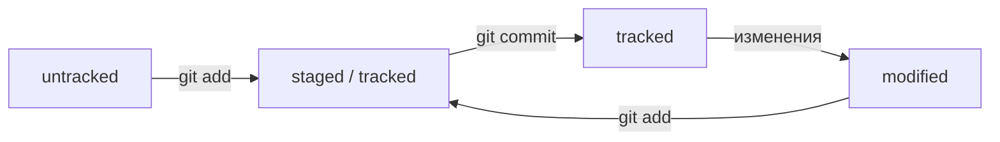

# Шпаргалка Git
## Git-команды
### Добавление изменений в последний коммит
```git commit --amend --no-edit``` (от англ. amend, «исправить») — добавь изменения к последнему коммиту и оставь сообщение прежним;

```git commit --amend -m "Новое сообщение"``` — измени сообщение к последнему коммиту на Новое сообщение.
### «Откат» файлов и коммитов
Допустим, вы создали или изменили какой-то файл и добавили его в список «на коммит» (staging area) с помощью ```git add```, но потом передумали включать его туда. Убрать файл из staging поможет команда ```git restore --staged``` <file> (от англ. restore — «восстановить»).

```git reset --hard b576d89``` (от англ. reset, «сброс», «обнуление» + hard, «суровый») — удали все незакоммиченные изменения из staging и «рабочей зоны» вплоть до указанного коммита.
### Просмотр изменений
```git diff``` (от англ. difference, «отличие», «разница») — покажи изменения в «рабочей зоне», то есть в modified-файлах;

```git diff a9928ab 11bada1``` — выведи разницу между двумя коммитами;

```git diff --staged``` — покажи изменения, которые добавлены в staged-файлах.
### Создание веток
```git branch feature/the-finest-branch``` (от англ. branch, «ветка») — создай ветку от текущей с названием feature/the-finest-branch;

```git checkout -b feature/the-finest-branch``` — создай ветку feature/the-finest-branch и сразу переключись на неё.
### Навигация по веткам
```git branch``` — покажи, какие есть ветки в репозитории и в какой из них я нахожусь (текущая ветка будет отмечена символом *);

```git branch -a``` — покажи все известные ветки, как локальные (в локальном репозитории), так и удалённые (в origin на GitHub);

```git checkout feature/br``` — переключись на ветку feature/br.
### Сравнение веток
```git diff main HEAD``` (от англ. difference, «отличие», «разница») — покажи разницу между веткой main и указателем на HEAD;

```git diff HEAD~2 HEAD``` — покажи разницу между тем коммитом, который был два коммита назад, и текущим.
### Удаление веток
```git branch -d br-name``` — удали ветку br-name, но только если она является частью main;

```git branch -D br-name``` — удали ветку br-name, даже если она не объединена с main.
### Слияние веток
```git merge main``` (от англ. merge, «сливать», «поглощать») — объедини ветку main с текущей активной веткой.

```
$ git checkout main # перешли в main
$ git pull # подтянули новые изменения в main
$ git checkout my-branch # вернулись в рабочую ветку my-branch
$ git merge main # влили main в новую ветку my-branch
$ git push -u origin my-branch # отправили ветку my-branch в удалённый репозиторий
```
### Работа с удалённым репозиторием
```git push -u origin my-branch``` (от англ. push, «толкнуть», «протолкнуть») — отправь новую ветку my-branch в удалённый репозиторий и свяжи локальную ветку с удалённой, чтобы при дополнительных коммитах можно было писать просто git push, без -u;

```git push my-branch``` — отправь дополнительные изменения в ветку my-branch, которая уже существует в удалённом репозитории;

```git pull``` (от англ. pull, «вытянуть») — подтяни изменения текущей ветки из удалённого репозитория.

### Удалите текущий привязанный origin.
```git remote rm origin``` - эта команда удалит текущий origin
  
## Хеш — идентификатор коммита.
*Хеширование* (от англ. hash, «рубить», «крошить», «мешанина») — это способ преобразовать набор данных и получить их «отпечаток» (англ. fingerprint).

*Информация о коммите* — это набор данных: когда был сделан коммит, содержимое файлов в репозитории на момент коммита и ссылка на предыдущий, или родительский (англ. parent), коммит. Git хеширует (преобразует) эту информацию с помощью алгоритма SHA-1 (от англ. Secure Hash Algorithm — «безопасный алгоритм хеширования») и получает для каждого коммита свой уникальный хеш — результат хеширования.
* если хеш получить дважды для одного и того же набора входных данных, то результат будет гарантированно одиаковый;
* если хоть что-то в исходных данных поменяется (хотя бы один символ), то хеш тоже изменится (причём сильно).
  
Все хеши и таблицу хеш → информация о коммите Git сохраняет в служебные файлы. Они находятся в скрытой папке .git в репозитории проекта.

## **Лог (git log)** 
Вот из каких элементов состоит описание:
1. Строка из цифр и латинских букв после слова commit — это уже знакомый вам хеш коммита.
2. Author — имя автора и его электронная почта.
3. Date — дата и время создания коммита.
4. Сообщение к коммиту.
```
commit e83c5163316f89bfbde7d9ab23ca2e25604af290
Author: Linus Torvalds <torvalds@linux-foundation.org>
Date:   Thu Apr 7 15:13:13 2005 -0700

    Initial revision of "git", the information manager from hell
```
Если в репозитории уже много коммитов — например, сотни или тысячи, — пригодится сокращённый лог. С ним можно быстро найти нужный коммит по описанию. Сокращённый лог вызывают командой **git log** с флагом **--oneline** (англ. «одной строкой»). При этом в терминале появятся только первые несколько символов хеша каждого коммита и комментарии к ним

## **HEAD — всему голова**
При вызове команды git log вы также могли заметить надпись (HEAD -> master) после хеша одного из коммитов. Файл HEAD (англ. «голова», «головной») — один из служебных файлов папки .git. Он указывает на коммит, который сделан последним (то есть на самый новый).

Внутри HEAD — ссылка на служебный файл: refs/heads/master (или refs/heads/main в зависимости от названия ветки). Если заглянуть в этот файл, можно увидеть хеш последнего коммита.

Когда вы делаете коммит, Git обновляет refs/heads/master — записывает в него хеш последнего коммита. Получается, что HEAD тоже обновляется, так как ссылается на refs/heads/master. При работе с Git указатель HEAD используется довольно часто. Мы уже упоминали, что многие команды Git принимают в качестве параметра хеш коммита. Если нужно передать последний коммит, то вместо его хеша можно просто написать слово HEAD — Git поймёт, что вы имели в виду последний коммит.

## **Статусы файлов**

